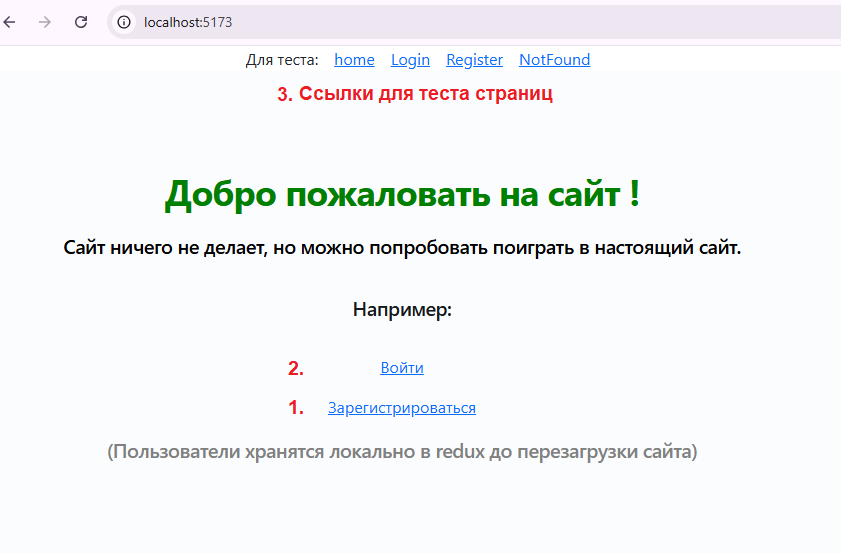

# reactRouterRedux 

## Домашнее задание. Роутинг и управление стейтом с React

**Цель:**
Научиться писать сложный фронтенд с роутингом и управлением стейтом
Разобраться с подключением сторонних плагинов и UI компонентов

**Описание/Пошаговая инструкция выполнения домашнего задания:**
+ Установить react-router;
+ Добавить отдельные компоненты страниц - Login / Register / HomePage / 404;
+ Добавить стейт-менеджемент с Redux;
+ Найти возможное дублирование кода и применить HOC паттерн.

## Просмотр проекта

1) Скачать проект

``` git clone https://github.com/m1skipper/reactRouterRedux.git ```

2) Скачать зависимости

``` npm install ```

3) Запустить проект

``` npm run dev ```

4) Открыть сайт по умолчанию http://localhost:5173

.

5) Вначале нужно зарегистрировать пользователя нажав ссылку 1. "Зарегистрироваться"

6) При успешной регистрации будет предложено залогинится 2. "Войти"

7) Сверху расположена плашка с быстрым доступом к страницам для теста 3.

## Выполнение проекта

1) Создан проект react

``` npm create vite@latest ```  

2) Установлена библиотека mui

``` npm install @mui/joy @emotion/react @emotion/styled ```  

3) Созданы страницы /src/pages/:  
HomePage.tsx, LoginPage.tsx, NotFoundPage.tsx, RegisterPage.tsx 

4) Установлен и добавлен роутер в ./Asp.tsx

``` npm install react-router ```  

5) Установлен redux для управления состоянием

``` npm install @reduxjs/toolkit react-redux ```  

6) Создан менеджер состояний в /src/store
	+ Класс описывающий пользователя user.ts
	+ Хранилище store.ts
	+ Слайсеры usersSliceAsync.ts:   
		Синхоронные методы управления состоянием register, logout, resetStatus.  
		Для примера, один асинхронный метод эмуляция запроса: login.
 
7) Добавлены вспомогательные компоненты /src/components
	+ MessageBox.tsx - диалог для отображения ошибок
	+ HocWithChangingColor.tsx - высокоуровневый компонент для добавления мерцания цвета текста
